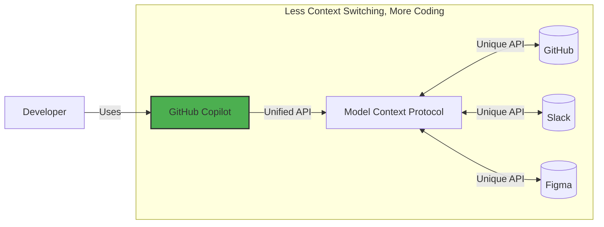

## Step 1: Introduction to MCP and environment setup


You're working on Mergington High School's extracurricular activities website, which allows students to sign up for events and activities.

<details>
<summary>📸 Show screenshot</summary><br/>


</details>

More teachers are starting to use the website! 🎉 The challenge? They have great ideas for improvements, but we need to manage all these feature requests efficiently and possibly research how similar open source projects have implemented such features!

That's where Model Context Protocol (MCP) comes in! By adding the GitHub MCP server, we'll extend Copilot's capabilities beyond code generation to include repository research and issue management. 🧑‍🚀

Let's get started!

### 📖 Theory: What is Model Context Protocol (MCP)?

[Model Context Protocol (MCP)](https://modelcontextprotocol.io/introduction) is often referred to as "USB-C for AI" - a universal connector that allows GitHub Copilot (and other AI tools) to seamlessly interact with other services.

Essentially, it is a way to describe the capabilities and requirements of a service, so AI tools can easily determine what methods to use and to accurately provide the parameters. An MCP server is providing that interface.



### :keyboard: Activity: Get to know your environment

Before we dive into MCP, let's start up our development environment and refamiliarize ourself with the extracurricular activity application.

1. Right-click the below button to open the **Create Codespace** page in a new tab. Use the default configuration.

   [](https://codespaces.new/{{full_repo_name}}?quickstart=1)

1. Validate the **Copilot Chat** and **Python** extensions are installed and enabled.

   <br/>
   

1. Verify our application runs before modification. In the left sidebar, select the **Run and Debug** tab and then press the **Start Debugging** icon.

   <details>
   <summary>📸 Show screenshot</summary><br/>

   

   </details>

   <details>
   <summary>🤷 Having trouble?</summary><br/>

   If the **Run and Debug** area is empty, try reloading VS Code: Open the command palette (`Ctrl`+`Shift`+`P`) and search for `Developer: Reload Window`.

   

   </details>

1. Use the **Ports** tab to find the webpage address, open it, and verify it is running.

   <details>
   <summary>📸 Show screenshot</summary><br/>

   

   

   </details>

1. (Optional) Take a moment to explore the website and codebase to familiarize yourself with the extracurricular activities application. This is the same website featured in the [Getting Started with GitHub Copilot](https://github.com/skills/getting-started-with-github-copilot) exercise.

   <details>
   <summary>💡 Exploring the application</summary><br/>

   - Browse the website interface to see how students can sign up for activities
   - Look at the code structure in VS Code to understand how the application works

   </details>

### :keyboard: Activity: Add the GitHub MCP server

1. Inside your codespace, open the **Copilot Chat** panel and verify **Agent** mode is selected.

   


1. Inside your codespace, navigate to the `.vscode` folder, and create a new file named `mcp.json`. Paste the following contents:

   📄 **.vscode/mcp.json**

   ```json
   {
     "servers": {
       "github": {
         "type": "http",
         "url": "https://api.githubcopilot.com/mcp/"
       }
     }
   }
   ```

1. In the `.vscode/mcp.json` file, click the **Start** button and accept the prompt to authenticate with GitHub. This has just informed GitHub Copilot of the MCP server's capabilities.

   

   <br/>

   

1. In the Copilot side panel, click the **🛠️ icon** to show the additional capabilities.

   

   

1. **Commit** and **push** the `.vscode/mcp.json` file to the `main` branch.

   > 🪧 **Note:** Pushing directly to `main` is not a recommended practice. It is only to simplify this exercise.

1. Now that your MCP server configuration is pushed to GitHub, Mona should already be busy checking your work. Give her a moment and keep watch in the comments. You will see her respond with progress info and the next lesson.

> [!NOTE]
> The next steps will involve creating GitHub issues. If you would like to avoid notification emails, you can unwatch the repository.

<details>
<summary>Having trouble?</summary><br/>

Make sure:

- Your `.vscode/mcp.json` file is similar to the example provided.
- You pushed the changes to the `main` branch.

</details>
